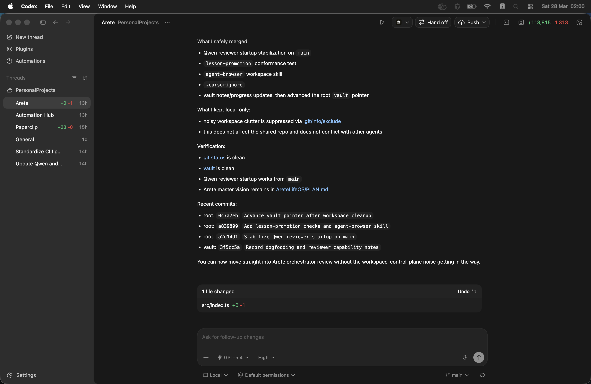
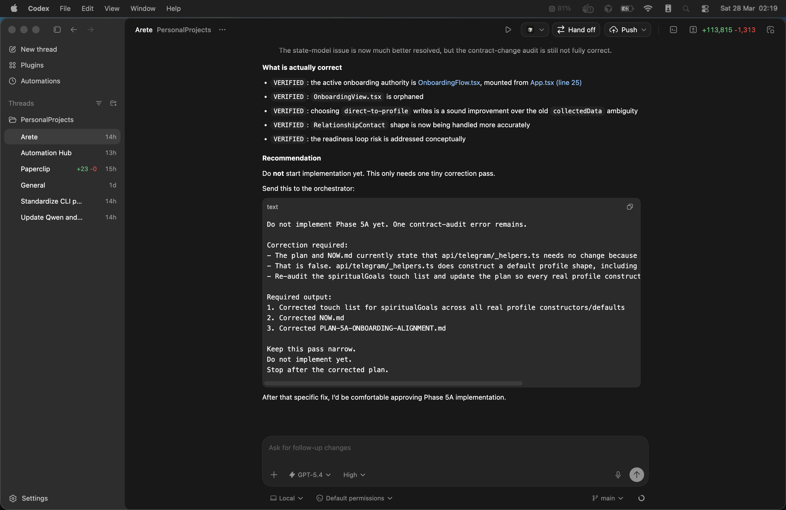
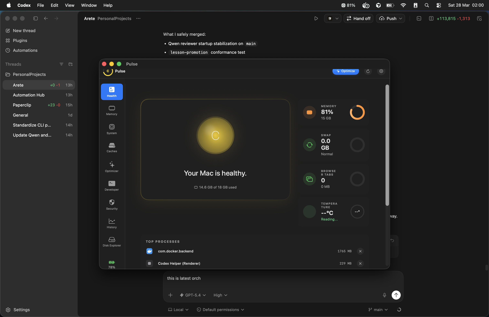
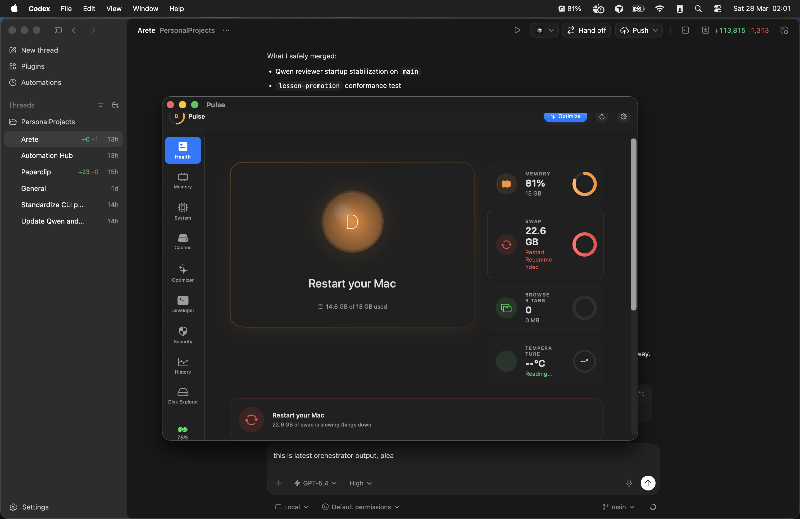

# Pulse v0.1 Execution Plan

> Frozen 2026-04-13. Follow this plan sequentially. Do not skip phases.
> Reference: V01_CONTRACT.md for scope boundaries.

---

## Canonical Build Model (Target State)

This describes the END STATE after all phases. During earlier phases,
the build model is whatever currently exists.

```
Target state (after Phase 1+):

Package.swift (SPM)
  Target: PulseCore (library)
    - cleanup engine
    - safety validation
    - protected paths
    - profiles (Xcode, Homebrew)
    - result model
    - NO AppKit, NO SwiftUI, NO ObservableObject
    - Foundation + Darwin only

  Target: PulseCLI (executable)
    - depends on PulseCore
    - ArgumentParser for CLI interface
    - 4 commands only

  Target: PulseCoreTests
    - tests for PulseCore

Pulse.xcodeproj (Xcode -- PulseApp only)
  Target: PulseApp
    - depends on PulseCore via SPM package dependency
    - SwiftUI views
    - menu bar lifecycle
    - entitlements, signing, notarization
    - AppKit, SwiftUI, UserNotifications
    - Monitoring services (memory, CPU, disk) -- stay here, not extracted

  Target: PulseAppTests
    - UI tests
```

How contributors build (target state):
- PulseCore + PulseCLI: swift build (works on any Mac with Xcode CLT)
- PulseApp: open Pulse.xcodeproj in Xcode, build the PulseApp scheme
- Tests: swift test (PulseCore tests) + Xcode test navigator (PulseApp tests)

DURING PHASE 0 (current state):
- Only SPM build exists (swift build, swift test)
- Pulse.xcodeproj exists but is not the primary build path
- CI uses swift build + swift test only

---

## Phase 0: Repo Hardening

Timeline: 3 days
Owner: Author

SCOPE: Fix what exists. Do not reference PulseCore, PulseCLI, or any future targets.

### 0.1: Git Hygiene

1. Remove Pulse.app binary from git tracking

   Command:
   git rm --cached -r Pulse.app/Contents/MacOS/Pulse
   git rm --cached Pulse.app/Contents/Info.plist
   git commit -m "chore: remove pre-built binary from git tracking"

   Update .gitignore (verify these lines exist, add if missing):
   Pulse.app/
   .build/
   *.xcuserdata/
   DerivedData/
   .doppler.env
   .doppler/

2. Remove .doppler.env if tracked

   Command:
   git rm --cached .doppler.env
   git commit -m "chore: remove doppler config from git"

3. Remove personal bundle IDs from source

   File: MemoryMonitor/Sources/Services/SecurityScanner.swift
   - Remove "com.jonathannugroho" from knownSafeBundleIDs array

   File: MemoryMonitor/Sources/Services/AppUninstaller.swift
   - Remove "com.jonathannugroho.Pulse"

   File: MemoryMonitor/Sources/Services/ComprehensiveOptimizer.swift
   - Remove "com.jonathannugroho.pulse" from appsToClose or similar whitelist

   Commit:
   git commit -m "fix: remove personal bundle IDs from source"

### 0.2: Screenshot Fixes

4. Embed real screenshots in README

   File: README.md
   Find: the "## Screenshots" section (currently prose descriptions only)
   Replace with actual markdown image references to existing files:

   ## Screenshots

   ### Menu Bar
   

   ### Dashboard - Health
   

   ### Dashboard - Security
   

   ### Permissions
   

   VERIFY: Open each PNG and confirm it matches the current app UI.
   If any screenshot is outdated, regenerate it or remove it.
   Do NOT leave placeholder prose.

   Commit:
   git commit -m "docs: embed real screenshots in README"

5. Git LFS decision (conditional)

   Current screenshot size: ~4 MB total (5 PNGs, ~800KB each).
   Decision: Do NOT add .gitattributes for LFS at this time.
   Rationale: 4 MB is well under GitHub's soft limit. LFS adds complexity
   (requires LFS installation for all contributors) that is not justified
   at this scale. Reassess if screenshots exceed 20 MB total.

### 0.3: Docs Reconciliation

6. Delete OPEN_SOURCE_READINESS.md

   Command:
   rm OPEN_SOURCE_READINESS.md
   git add -A && git commit -m "docs: remove self-assessment that missed critical issues"

7. Update ROADMAP.md

   File: ROADMAP.md
   Replace milestones section:

   | Milestone | Target | Status |
   |---|---|---|
   | Phase 0: Repo hardening | 2026-04 | In Progress |
   | Phase 0.5: Concurrency safety | 2026-04 | Planned |
   | Phase 1: PulseCore extraction | 2026-05 | Planned |
   | Phase 2: PulseCLI v0.1 | 2026-05 | Planned |
   | Phase 3: PulseApp shell | 2026-06 | Planned |
   | Phase 4: External alpha | 2026-06 | Planned |

   Update "Current Phase" to: "Phase 0 -- Repo Hardening"
   Remove "Phase 2 -- System Monitors + Optimizer" (it is complete, not in progress).

   Commit:
   git commit -m "docs: update ROADMAP.md to reflect v0.1 plan"

8. Update NOW.md

   File: NOW.md
   Replace content:

   # NOW - Pulse

   ## Current Task
   Phase 0: Repo Hardening

   ## Status
   active

   ## Last Gate
   Build: PASS (swift build successful)
   Test: PASS (verify current test count)

   ## Immediate Next Steps
   - Remove Pulse.app from git tracking
   - Embed real screenshots in README
   - Remove personal bundle IDs
   - Delete OPEN_SOURCE_READINESS.md
   - Update ROADMAP.md and NOW.md
   - Fix SafetyFeaturesTests to test real implementation

   Commit:
   git commit -m "docs: update NOW.md to Phase 0"

9. Update CAPABILITY_MATRIX.md

   File: CAPABILITY_MATRIX.md
   Add section at top:

   ## v0.1 Alpha Scope (2026-04)

   For v0.1 alpha, only these features are in active development:
   - Xcode cache cleanup (DerivedData, Archives, Device Support)
   - Homebrew cache cleanup
   - Safety validation (protected paths, dry-run, preview-first)
   - PulseCore extraction (cleanup engine as standalone library)
   - PulseCLI (thin interface over PulseCore)

   Features below marked with [v0.2] are deferred to the next release.

   Mark these as [v0.2]:
   - Node.js cleanup
   - Docker cleanup
   - Browser cache cleanup
   - System log/temp cleanup
   - Security scanner (code exists, hidden from v0.1 messaging)
   - Health score trends

   Commit:
   git commit -m "docs: mark v0.1 alpha scope in CAPABILITY_MATRIX.md"

10. Update README.md version and scope

    File: README.md
    Changes:
    - Replace "Version: 1.2.0" with "Version: 0.1.0 (alpha)"
    - Replace the roadmap section (lines 311-338) with:

    ## Roadmap

    ### v0.1 Alpha (Current)
    - Xcode cache cleanup (DerivedData, Archives, Device Support)
    - Homebrew cache cleanup
    - Safety validation (protected paths, preview-first)
    - PulseCore extraction
    - PulseCLI (4 commands)
    - PulseApp shell over PulseCore

    ### v0.2 (Planned)
    - Node.js cache cleanup
    - Docker cleanup (granular, not system prune)
    - Browser cache cleanup
    - System log/temp cleanup
    - Health score trends

    ### Future
    - Scheduled cleanup
    - Auto-updates
    - Additional profiles

    - Remove the comparison table with Stats/iStat Menus/CleanMyMac (lines 183-197).
      This table positions Pulse as a general system monitor, which contradicts
      the v0.1 cleanup focus.

    Commit:
    git commit -m "docs: update README.md for v0.1 alpha scope"

### 0.4: Build/Distribution Clarification (current state only)

11. Update CI workflow to match what ACTUALLY exists

    File: .github/workflows/ci.yml
    Current state: swift build + swift test (SPM). This is correct for now.
    Changes needed:
    - Remove swift-actions/setup-swift step (macos-14 runners include Swift)
    - Add cache for Swift Package Manager
    - Add xcodebuild step to verify Pulse.xcodeproj still builds

    New content:

    name: CI

    on:
      push:
        branches: [main]
      pull_request:
        branches: [main]

    jobs:
      build:
        runs-on: macos-14
        steps:
          - uses: actions/checkout@v4
          - name: Cache Swift Package Manager
            uses: actions/cache@v4
            with:
              path: .build
              key: ${{ runner.os }}-spm-${{ hashFiles('**/Package.resolved') }}
              restore-keys: ${{ runner.os }}-spm-
          - name: Build (SPM)
            run: swift build
          - name: Test (SPM)
            run: swift test
          - name: Build (Xcode)
            run: |
              xcodebuild -project Pulse.xcodeproj \
                -scheme Pulse \
                -configuration Debug \
                build \
                CODE_SIGN_IDENTITY="-" \
                DEVELOPMENT_TEAM="" \
                | xcpretty || true

    NOTE: This does NOT reference PulseCore or PulseCLI because they do not
    exist yet. It tests both build paths (SPM and Xcode) in parallel.

    Commit:
    git commit -m "ci: improve workflow with caching and Xcode build verification"

12. Leave distribution.yml unchanged for now

    File: .github/workflows/distribution.yml
    Action: DO NOT modify. It references Pulse.xcodeproj which is valid.
    It will need updates AFTER Phase 1 when PulseCore is extracted.
    Leave a comment at the top:
    # TODO: Update after Phase 1 (PulseCore extraction)

    Commit (if comment added):
    git commit -m "chore: add TODO note to distribution workflow"

### 0.5: Test Credibility

13. Rewrite SafetyFeaturesTests to test real implementation

    File: Tests/SafetyFeaturesTests.swift

    Current problem (line 189-266):
    TestSafetyHelpers is a hand-duplicated copy of the safety logic.
    It replicates isPathSafeToDelete() instead of testing the actual
    ComprehensiveOptimizer or StorageAnalyzer implementation.

    Required changes:
    - Remove TestSafetyHelpers enum entirely
    - Import @testable import Pulse (already present)
    - Test the actual methods:

    a. Test ComprehensiveOptimizer (or wherever the real safety logic lives):
       - Find the actual method that checks path safety
       - Call it directly in tests
       - If the method is private, use @testable access
       - If the logic is spread across multiple files, test each one

    b. Add integration test with temp directory:
       - Create a temp directory with known structure:
         - Allowed paths (caches, temp files)
         - Protected paths (/System, /usr, etc. -- use strings, not real paths)
         - User data paths (Documents, Desktop)
       - Run the actual scanForCleanup() method against it
       - Verify the CleanupPlan excludes protected paths
       - Verify the CleanupPlan includes allowed paths

    c. Keep the existing test cases (protected paths, allowed paths, app bundles,
       whitelist) but change them to call the real implementation.

    Commit:
    git commit -m "test: rewrite SafetyFeaturesTests to test real implementation"

    Verification:
    swift test --filter SafetyFeaturesTests
    Must pass. If it fails, the real implementation differs from the test
    expectations -- this is valuable information, fix the implementation.

### Phase-End Proof Report (Phase 0)

After completing all Phase 0 items, write PHASE0_REPORT.md:

# Phase 0 Report: Repo Hardening

Date: YYYY-MM-DD

## Files Changed
- (list every file modified/created/deleted)

## Commands Run
- (list every git command, swift build, swift test)

## Pass/Fail
- swift build: PASS/FAIL (include error output if fail)
- swift test: PASS/FAIL (include failure output if fail)
- Screenshots verified: YES/NO (list which match, which need regeneration)
- Personal bundle IDs removed: YES/NO (list which files were cleaned)
- Docs reconciled: YES/NO (confirm ROADMAP, NOW, CAPABILITY_MATRIX, README agree)
- SafetyFeaturesTests: PASS/FAIL (note any failures and what they reveal)

## Unresolved Issues
- (list anything that failed and was not fixed)

## Go/No-Go for Phase 0.5
- GO: all above pass
- NO-GO: (reason)

---

## Phase 0.5: Concurrency Safety

Timeline: 2 days
Owner: Author

SCOPE: Add @MainActor annotations and fix thread-safety issues. This is isolated
from Phase 0's git/docs/test changes to avoid mixing concerns.

### Why this is a separate subphase

Concurrency bugs are subtle. Mixing @MainActor annotations with git hygiene
and doc updates makes it impossible to isolate regressions. If the app crashes
after Phase 0, you will not know if it was caused by a doc update (unlikely)
or a concurrency fix (likely).

### Approach

Work in batches. After each batch, verify the app still builds and runs.

Batch 1: Data models and settings (lowest risk)
Files:
- MemoryMonitor/Sources/Models/AppSettings.swift
- MemoryMonitor/Sources/Models/MemoryTypes.swift
- MemoryMonitor/Sources/Models/Brand.swift
- MemoryMonitor/Sources/Models/DeveloperProfile.swift

Changes:
- Add @MainActor to classes that are ObservableObject
- Verify no @Published properties are set from background queues

Verification after Batch 1:
- swift build must pass
- swift test must pass
- App must launch and open dashboard without crash

Batch 2: Monitoring services (medium risk)
Files:
- MemoryMonitor/Sources/Services/SystemMemoryMonitor.swift
- MemoryMonitor/Sources/Services/ProcessMemoryMonitor.swift
- MemoryMonitor/Sources/Services/CPUMonitor.swift
- MemoryMonitor/Sources/Services/DiskMonitor.swift
- MemoryMonitor/Sources/Services/SystemHealthMonitor.swift

Changes:
- Add @MainActor to each class
- For background work (DispatchQueue.global), ensure results are published
  on main thread:
  DispatchQueue.global(qos: .userInitiated).async {
      let result = doWork()
      DispatchQueue.main.async {
          self.currentData = result  // @Published on main
      }
  }
- Add @Sendable to closures that cross isolation boundaries

Verification after Batch 2:
- swift build must pass
- swift test must pass
- App must monitor without crash for at least 60 seconds
- Check Console.app for Swift concurrency warnings (runtime warnings)

Batch 3: Coordinator and optimizer (highest risk)
Files:
- MemoryMonitor/Sources/Services/MemoryMonitorManager.swift
- MemoryMonitor/Sources/Services/ComprehensiveOptimizer.swift
- MemoryMonitor/Sources/Services/AutoKillManager.swift
- MemoryMonitor/Sources/Services/SecurityScanner.swift

Changes:
- Add @MainActor to each class
- ComprehensiveOptimizer: this is the hardest. It publishes isWorking,
  statusMessage, progress, needsConfirmation, currentPlan, appsToClose
  from background queues. Each must be wrapped in DispatchQueue.main.async.
- Alternative: if ComprehensiveOptimizer is too entangled, defer full
  @MainActor conformance to Phase 1 extraction (where it will be split
  into PulseCore (no UI) and adapter (UI)).

Verification after Batch 3:
- swift build must pass
- swift test must pass
- App must run cleanup flow without crash
- No runtime concurrency warnings in Console.app

### What to watch for

1. Swift concurrency warnings at runtime:
   "Publishing changes from background threads is not allowed"
   These indicate an @Published property is being set off the main thread.
   Fix: wrap the assignment in DispatchQueue.main.async.

2. Data races:
   If a singleton is accessed from multiple threads simultaneously,
   @MainActor alone may not be enough. Consider using an actor instead
   of a class for services that do heavy background work.

3. @MainActor inheritance:
   If MemoryMonitorManager is @MainActor and it holds references to
   services that are NOT @MainActor, the compiler will warn. Fix by
   making all held services @MainActor or using @unchecked Sendable.

### Phase 0.5 Proof Report

After completing all batches, write PHASE05_REPORT.md:

# Phase 0.5 Report: Concurrency Safety

Date: YYYY-MM-DD

## Files Changed
- (list every file with @MainActor changes)

## Batches Completed
- Batch 1: PASS/FAIL
- Batch 2: PASS/FAIL
- Batch 3: PASS/FAIL

## Commands Run
- swift build
- swift test
- (app launch test, 60-second monitoring test, cleanup flow test)

## Runtime Warnings Found
- (list any Swift concurrency runtime warnings and how they were fixed)

## Unresolved Issues
- (any services deferred to Phase 1 extraction)

## Go/No-Go for Phase 1
- GO: no runtime warnings, all batches pass
- NO-GO: (reason)

---

## Phase 1: PulseCore Extraction

Timeline: 7 days
Owner: Author

SCOPE: Extract the cleanup engine into a standalone Swift package target
with zero UI coupling.

### What gets extracted

The following types and logic move from MemoryMonitor/Sources/ into
Sources/PulseCore/:

1. Types (pure data, no UI):
   - CleanupPlan struct (and nested CleanupItem, CleanupWarning)
   - CleanupPriority enum
   - OptimizeResult struct
   - Profile definitions (what files/directories each profile targets)

2. Safety logic:
   - Protected path deny-list
   - Path validation (isPathSafeToDelete or equivalent)
   - In-use file detection (best-effort)
   - Size limit enforcement (100GB max)

3. Scan logic:
   - scanForCleanup() / dry-run
   - scanDeveloperCaches() -- Xcode only (Homebrew deferred)
   - scanHomebrewCaches() -- Homebrew only
   - Size estimation for each candidate

4. Apply logic:
   - executeCleanup() / apply
   - Trash-based deletion (where applicable)
   - Direct deletion (where documented)
   - Result reporting (what was cleaned, what was skipped, why)

### What does NOT get extracted

- @Published properties (these are UI state)
- ObservableObject conformance
- ScanPhase enum with UX timing (Thread.sleep, statusMessage)
- AppSettings dependency (will be replaced with injectable protocol)
- AppKit imports (NSWorkspace, NSRunningApplication)
- Any SwiftUI or AppKit code
- Monitoring services (memory, CPU, disk)
- Security scanner
- AutoKillManager
- Any view code

### Files created

- Sources/PulseCore/PulseCore.swift (module entry, exports)
- Sources/PulseCore/CleanupPlan.swift (types)
- Sources/PulseCore/CleanupEngine.swift (scan + execute)
- Sources/PulseCore/SafetyValidator.swift (protected paths, validation)
- Sources/PulseCore/Profiles/XcodeProfile.swift
- Sources/PulseCore/Profiles/HomebrewProfile.swift
- Sources/PulseCore/ResultModel.swift (OptimizeResult)
- Sources/PulseCore/TrashManager.swift (deletion logic)
- Sources/PulseCore/DirectoryScanner.swift (size estimation)
- Tests/PulseCoreTests/CleanupPlanTests.swift
- Tests/PulseCoreTests/SafetyValidatorTests.swift
- Tests/PulseCoreTests/CleanupEngineTests.swift
- Tests/PulseCoreTests/IntegrationTests.swift (temp directory tests)

### Files modified

- Package.swift (add PulseCore target, update existing target paths)
- MemoryMonitor/Sources/Services/ComprehensiveOptimizer.swift
  Option A: Delete entirely (all logic moved to PulseCore)
  Option B: Keep as thin adapter that delegates to PulseCore (easier migration)
  Recommendation: Option B for Phase 1, Option A for Phase 3

### Package.swift (new structure)

```swift
// swift-tools-version: 5.9
import PackageDescription

let package = Package(
    name: "Pulse",
    platforms: [.macOS(.v14)],
    products: [
        .library(name: "PulseCore", targets: ["PulseCore"]),
    ],
    dependencies: [],
    targets: [
        .target(
            name: "PulseCore",
            path: "Sources/PulseCore"
        ),
        .testTarget(
            name: "PulseCoreTests",
            dependencies: ["PulseCore"],
            path: "Tests/PulseCoreTests"
        ),
        .executableTarget(
            name: "Pulse",
            dependencies: ["PulseCore"],
            path: "MemoryMonitor/Sources"
        ),
        .testTarget(
            name: "PulseTests",
            dependencies: ["Pulse"],
            path: "Tests"
        ),
    ]
)
```

Note: The existing Pulse executable target (MemoryMonitor/Sources) stays
for now. It depends on PulseCore. After Phase 3 (PulseApp shell), it can
be removed entirely.

### Extraction approach

Day 1-2: Move types
- Copy CleanupPlan, CleanupPriority, OptimizeResult to PulseCore
- Make them public
- Keep existing references working via type aliases in the app

Day 3-4: Move safety + scan logic
- Copy SafetyValidator, DirectoryScanner to PulseCore
- Rewrite to use protocols instead of AppSettings singleton
- Write tests against real implementation

Day 5-6: Move apply logic
- Copy TrashManager, executeCleanup to PulseCore
- Test with temp directory

Day 7: Integration
- Wire PulseCore into existing ComprehensiveOptimizer (adapter pattern)
- Verify app still works end-to-end
- All tests pass

### Risks

- ComprehensiveOptimizer is 1,648 lines with deep UI coupling. Extraction
  will require careful separation of business logic from @Published state.
- AppSettings is a singleton used throughout. Need protocol abstraction.
- Thread.sleep calls in scan methods are UX timing, not business logic.
  Remove them in PulseCore (CLI does not need fake delays).
- AppKit imports (NSWorkspace for app detection) need protocol abstraction.
  Define a protocol AppDetector that PulseCore uses, and the app provides
  the real implementation.

### Acceptance criteria

- PulseCore builds with zero AppKit/UIKit imports
- PulseCore has zero @Published properties
- PulseCore has zero ObservableObject conformance
- PulseCore has zero Thread.sleep calls
- PulseCoreTests passes (including temp directory integration tests)
- SafetyValidator tests hit real implementation, not duplicated helpers
- Existing app still builds and runs (ComprehensiveOptimizer delegates to PulseCore)
- No code duplication between PulseCore and app code

### What NOT to do

- Do not add new cleanup profiles
- Do not refactor the cleanup logic itself (extract as-is)
- Do not add Linux support
- Do not add new dependencies
- Do not change the safety model
- Do not extract the security scanner
- Do not extract monitoring services
- Do not add CLI yet (Phase 2)

### Phase 1 Proof Report

Write PHASE1_REPORT.md:

# Phase 1 Report: PulseCore Extraction

Date: YYYY-MM-DD

## Files Changed
- (list every new, modified, deleted file)

## Commands Run
- swift build --target PulseCore
- swift build --target Pulse
- swift test --filter PulseCoreTests
- swift test --filter PulseTests

## Pass/Fail
- PulseCore build: PASS/FAIL
- Pulse (app) build: PASS/FAIL
- PulseCoreTests: PASS/FAIL
- PulseTests: PASS/FAIL
- App launches and runs cleanup: PASS/FAIL
- Zero AppKit imports in PulseCore: PASS/FAIL
- Zero @Published in PulseCore: PASS/FAIL
- Zero ObservableObject in PulseCore: PASS/FAIL

## Unresolved Issues
- (list anything deferred or broken)

## Go/No-Go for Phase 2
- GO: all above pass
- NO-GO: (reason)

---

## Phase 2: PulseCLI v0.1

Timeline: 5 days
Owner: Author

SCOPE: Build the thin CLI interface over PulseCore. Exactly 4 commands.

### Dependencies to add

Add ArgumentParser to Package.swift:

```swift
dependencies: [
    .package(url: "https://github.com/apple/swift-argument-parser", from: "1.4.0"),
],
```

### Files created

- Sources/PulseCLI/main.swift (entry point, registers commands)
- Sources/PulseCLI/Commands/AnalyzeCommand.swift
- Sources/PulseCLI/Commands/CleanCommand.swift
- Sources/PulseCLI/Formatters/OutputFormatter.swift
- Tests/PulseCLITests/ (basic command parsing tests)

### Package.swift update

Add PulseCLI target:

```swift
.executableTarget(
    name: "PulseCLI",
    dependencies: [
        "PulseCore",
        .product(name: "ArgumentParser", package: "swift-argument-parser"),
    ],
    path: "Sources/PulseCLI"
),
.testTarget(
    name: "PulseCLITests",
    dependencies: ["PulseCLI"],
    path: "Tests/PulseCLITests"
),
```

### Commands

1. pulse analyze

   Scans all v0.1 profiles (Xcode, Homebrew).
   Shows total reclaimable space.
   Shows breakdown by category.
   Shows what will NOT be touched.
   Exits 0.

   Example output:
   ```
   Pulse v0.1.0 - Safe cleanup for macOS developers

   Scanning Xcode caches...
   Scanning Homebrew caches...

   You can reclaim 14.8 GB safely:

   Xcode
     DerivedData          8.2 GB
     Archives             3.1 GB
     Device Support       2.4 GB
     iOS Simulators       0.8 GB

   Homebrew
     Cache                0.3 GB

   Total reclaimable: 14.8 GB
   Run 'pulse clean --dry-run' to preview what will be deleted.
   ```

2. pulse clean --dry-run

   Runs scan across all v0.1 profiles.
   Shows itemized list with sizes.
   Shows warnings (if any apps need to be closed).
   Does NOT delete anything.
   Exits 0.

3. pulse clean --profile <name> --dry-run

   Runs scan for a single profile.
   Profile names: xcode, homebrew
   Shows itemized list.
   Exits 0.

4. pulse clean --profile <name> --apply

   Runs scan for single profile.
   Shows preview.
   Asks for confirmation (y/n).
   If yes, executes cleanup.
   Shows results (GB reclaimed, paths cleaned, duration).
   Exits 0 on success, 1 on failure, 2 on user cancelled.

### Output format

- Plain text, terminal-friendly
- No colors required (use standard output, optional color via environment variable)
- Machine-readable option: --json flag for all commands
- Progress indicator during scan (simple dots or spinner)
- Summary table at end

### Risks

- ArgumentParser has a learning curve but is well-documented.
- Terminal output formatting requires care (line widths, alignment).
- Confirmation dialog in non-interactive terminals (CI, scripts) must fail
  gracefully, not hang.
- Error messages must be clear and non-scary.

### Acceptance criteria

- All 4 commands build: swift build --target PulseCLI
- All 4 commands work on a fresh Mac with Xcode CLT
- swift build -c release && .build/release/pulse analyze produces useful output
- --dry-run is the default behavior for clean command
- --apply requires explicit confirmation (y/n)
- Output is readable and professional
- JSON output is valid and parseable (--json flag)
- No crashes on empty profiles (e.g., no Homebrew installed)
- Exit codes are correct (0 = success, 1 = error, 2 = user cancelled)
- PulseCLITests passes

### What NOT to do

- Do not add "pulse doctor"
- Do not add "pulse profiles list"
- Do not add "pulse clean --interactive"
- Do not add scheduling or automation
- Do not add colored output as a requirement
- Do not add network calls or telemetry
- Do not add Node.js, Docker, browser, or system profiles (v0.2)

### Phase 2 Proof Report

Write PHASE2_REPORT.md:

# Phase 2 Report: PulseCLI v0.1

Date: YYYY-MM-DD

## Files Changed
- (list)

## Commands Run
- swift build --target PulseCLI
- swift test --filter PulseCLITests
- .build/release/pulse analyze
- .build/release/pulse clean --profile xcode --dry-run
- .build/release/pulse clean --profile xcode --apply

## Pass/Fail
- PulseCLI build: PASS/FAIL
- PulseCLITests: PASS/FAIL
- pulse analyze output correct: PASS/FAIL
- pulse clean --dry-run shows preview: PASS/FAIL
- pulse clean --apply requires confirmation: PASS/FAIL
- Exit codes correct: PASS/FAIL
- JSON output valid: PASS/FAIL

## Unresolved Issues
- (list)

## Go/No-Go for Phase 3
- GO: all above pass
- NO-GO: (reason)

---

## Phase 3: PulseApp Shell

Timeline: 5 days
Owner: Author

SCOPE: Wire PulseApp to use PulseCore. Keep existing monitoring features.
Do not redesign the UI.

### Files affected

- Pulse.xcodeproj (add PulseCore as SPM dependency)
- MemoryMonitor/Sources/ (refactor to use PulseCore)
- ComprehensiveOptimizer.swift (convert to thin adapter or delete)
- All views that reference cleanup plans/results (update to use PulseCore types)

### Approach

1. Add PulseCore as SPM dependency in Xcode project
   - File > Add Package Dependencies > select local Pulse package
   - This makes PulseCore available to PulseApp

2. Create PulseCoreAdapter

   @MainActor
   class PulseCoreAdapter: ObservableObject {
       let core = PulseCore.CleanupEngine()

       @Published var currentPlan: PulseCore.CleanupPlan?
       @Published var isScanning = false
       @Published var lastResult: PulseCore.CleanupResult?

       func scan(profile: PulseCore.Profile?) async {
           isScanning = true
           currentPlan = core.scan(profile: profile)
           isScanning = false
       }

       func apply(plan: PulseCore.CleanupPlan) async -> PulseCore.CleanupResult {
           let result = core.apply(plan: plan)
           lastResult = result
           return result
       }
   }

3. Update views
   - Replace references to ComprehensiveOptimizer with PulseCoreAdapter
   - Map PulseCore types to view models where needed
   - Keep existing monitoring views unchanged

4. Update menu bar
   - Show cleanup status alongside memory percentage
   - Add quick cleanup action (triggers PulseCoreAdapter.scan + apply)

### Risks

- Xcode project + SPM local package can be fragile. Test after every change.
- 87 source files need review for PulseCore API changes.
- Risk of breaking existing monitoring features during migration.
- ComprehensiveOptimizer deletion is irreversible -- prefer adapter pattern
  until Phase 3 is verified.

### Acceptance criteria

- PulseApp builds from Xcode
- PulseApp runs and shows dashboard
- Cleanup preview works (uses PulseCore)
- Cleanup apply works (uses PulseCore)
- Menu bar shows cleanup status
- No regression in monitoring features (memory, CPU, disk still work)
- PulseApp does not import PulseCore directly -- goes through adapter
- swift build still works (CLI + PulseCore unchanged)

### What NOT to do

- Do not redesign the UI
- Do not add new tabs or features
- Do not change the monitoring services
- Do not remove existing features
- Do not add health score redesign
- Do not change the security scanner UI

### Phase 3 Proof Report

Write PHASE3_REPORT.md:

# Phase 3 Report: PulseApp Shell

Date: YYYY-MM-DD

## Files Changed
- (list)

## Commands Run
- swift build --target PulseCore
- swift build --target PulseCLI
- xcodebuild -project Pulse.xcodeproj -scheme PulseApp build
- Manual test: launch app, run cleanup flow

## Pass/Fail
- PulseCore build: PASS/FAIL
- PulseCLI build: PASS/FAIL
- PulseApp build: PASS/FAIL
- Cleanup preview works: PASS/FAIL
- Cleanup apply works: PASS/FAIL
- Monitoring features unchanged: PASS/FAIL
- No crashes after 60 seconds of use: PASS/FAIL

## Unresolved Issues
- (list)

## Go/No-Go for Phase 4
- GO: all above pass
- NO-GO: (reason)

---

## Phase 4: External Alpha Validation

Timeline: 7 days (includes waiting for testers)
Owner: Author

SCOPE: Get 10 external testers to install, run, and validate the alpha.

### Step 1: Create GitHub Release

After Phase 3 passes:
- git tag -a v0.1.0-alpha -m "Pulse v0.1.0 alpha - safe developer cleanup for macOS"
- git push origin main
- git push origin v0.1.0-alpha
- Create GitHub Release from the tag with:
  - Scope description (Xcode + Homebrew cleanup only)
  - Installation instructions (both CLI and App)
  - Known limitations
  - How to report issues

### Step 2: Recruit Testers

- Target: 15 recruited, expect 10 to complete
- Channels: Swift Discord, macOS dev forums, personal network, Twitter/X
- Criteria: macOS developers who use Xcode or Homebrew

### Step 3: Provide Test Instructions

Testers receive:
1. Clone: git clone https://github.com/jonathannugroho/pulse.git
2. Build: cd pulse && swift build -c release
3. Run: .build/release/pulse analyze
4. Preview: .build/release/pulse clean --profile xcode --dry-run
5. Apply (optional): .build/release/pulse clean --profile xcode --apply
6. Report: fill out feedback form or open GitHub Issue

### Step 4: Collect Feedback

Track:
- GB reclaimed per tester
- Time to first value (install to first successful command)
- Errors encountered (build, runtime, logic)
- False positives (items flagged for cleanup that should not be)
- False negatives (items that should be flagged but were not)
- Tester confidence in safety (1-5 scale)

### Step 5: Triage and Fix

- Fix build issues immediately (P0)
- Fix crashes immediately (P0)
- Fix false positives (P1)
- Document false negatives as known limitations (P2)
- Log feature requests for v0.2 (backlog)

### Acceptance criteria (alpha exit)

- 10 external testers have completed dry-run
- Zero destructive bugs (no accidental protected-path deletion)
- All P0 bugs fixed
- README updated based on real-world install feedback
- All V01_CONTRACT.md alpha exit criteria are met

### What NOT to do

- Do not add features based on tester requests (log for v0.2)
- Do not expand scope during alpha
- Do not promise features not in v0.1 contract
- Do not ignore bug reports
- Do not declare alpha complete before all criteria are met

### Phase 4 Proof Report

Write PHASE4_REPORT.md:

# Phase 4 Report: External Alpha Validation

Date: YYYY-MM-DD

## Testers Recruited: N
## Testers Completed: N

## Metrics
- Median GB reclaimed: X GB
- Median time to first value: X minutes
- Dry-run completion rate: X%
- Apply completion rate: X%
- Errors reported: N (breakdown by type)
- False positives: N
- False negatives: N

## Commands Run
- (build and test commands used during triage)

## Pass/Fail
- 10 testers completed dry-run: PASS/FAIL
- Zero destructive bugs: PASS/FAIL
- All P0 bugs fixed: PASS/FAIL
- README updated: PASS/FAIL
- V01_CONTRACT.md exit criteria met: PASS/FAIL

## Unresolved Issues
- (list any known limitations or deferred bugs)

## Alpha Status
- COMPLETE: all criteria met
- INCOMPLETE: (reason, what is blocking)

---

## Timeline Summary

| Phase | Duration | Start | End | Gate |
|---|---|---|---|---|
| Phase 0: Repo Hardening | 3 days | Day 1 | Day 3 | swift build + test pass, docs reconciled |
| Phase 0.5: Concurrency Safety | 2 days | Day 4 | Day 5 | No runtime warnings, app stable |
| Phase 1: PulseCore Extraction | 7 days | Day 6 | Day 12 | PulseCore builds with zero UI coupling |
| Phase 2: PulseCLI v0.1 | 5 days | Day 13 | Day 17 | All 4 commands work on fresh Mac |
| Phase 3: PulseApp Shell | 5 days | Day 18 | Day 22 | PulseApp builds, cleanup works, monitoring unchanged |
| Phase 4: External Alpha | 7 days | Day 23 | Day 29 | 10 testers complete dry-run, zero destructive bugs |

Total: 29 days to alpha.

## Dependency Graph

Phase 0 must complete before Phase 0.5
Phase 0.5 must complete before Phase 1
Phase 1 must complete before Phase 2 and Phase 3
Phase 2 and Phase 3 can run in parallel after Phase 1
Phase 4 requires both Phase 2 and Phase 3 to be complete

## Risk Register

| Risk | Probability | Impact | Mitigation |
|---|---|---|---|
| PulseCore extraction takes longer than 7 days | HIGH | HIGH | Extract minimum viable core first (scan + apply + safety). Defer profile registry. |
| @MainActor annotations reveal crashes | MEDIUM | HIGH | Fix as found in Phase 0.5. Better to find now than after alpha. |
| External testers do not respond | MEDIUM | MEDIUM | Recruit 15, expect 10. Post in 3+ communities. |
| Xcode project + SPM sync breaks | MEDIUM | MEDIUM | Test PulseApp build after every PulseCore change in Phase 1. |
| Cleanup false positives | LOW | CRITICAL | Dry-run is default. Testers must complete dry-run before apply. |
| Scope creep during any phase | HIGH | HIGH | Reference V01_CONTRACT.md. Reject anything not in scope. |
| Concurrency fixes break existing functionality | MEDIUM | MEDIUM | Batch approach with verification after each batch. Revert if needed. |
| Phase 0 CI changes break the build | LOW | HIGH | CI changes only add caching and Xcode verification. No structural changes. |
